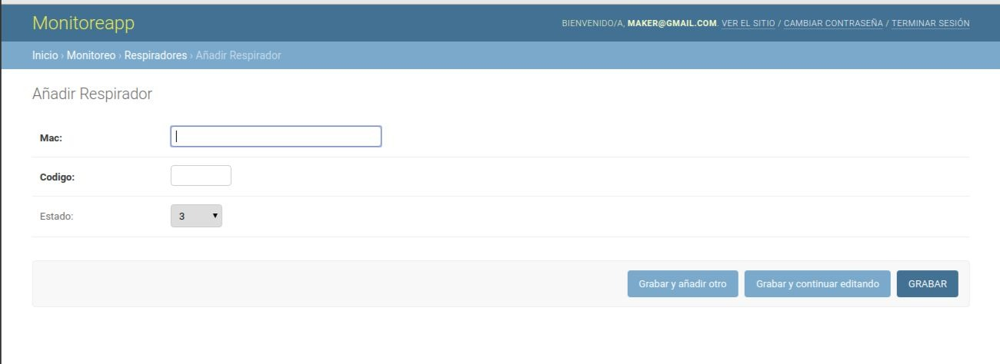
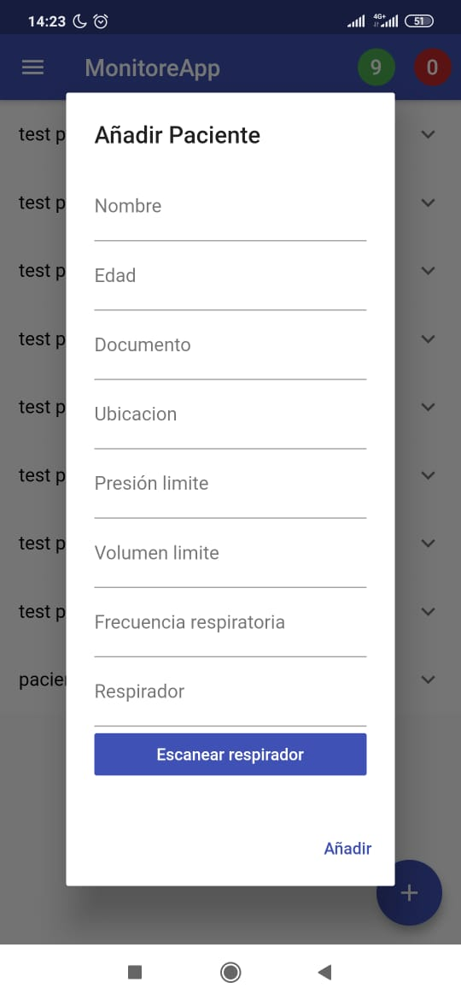

# ¿Cómo integro mis respiradores para usar la MONITOREAPP?

MONITOREAPP esta hecha para que cualquier fabricante de respirador se integre facilmente a nuestra api de desarrollo. Simplemente para integrar sus respiradores con MONITOREAPP debe seguir los siguientes pasos:

- Primero, es necesario que antes de enviar datos, el respirador sea agregado en el panel de administración, especificando la MAC del wifi y numero de stock.

- Segundo, es necesario que sus respiradores cuenten con una conexion wifi, para poder enviar datos a un servidor. A continuación un ejemplo de como enviar los datos usando un modulo wifi con ArduinoMega:

-----------------------------------------------

    // WiFi configuration
    #include <ESP8266WiFi.h>
    #include <ESP8266WiFiMulti.h>
    #include <WebSocketsClient.h>
    ESP8266WiFiMulti WiFiMulti;
    WebSocketsClient webSocket;
    //example MAC
    String macdelrespirador = "ac:34:bc:bc:8a:92"
    //example info
    String info = "25,40,500,FALLO ELECTRICO,1"
    void setup() {
        // Configure serial output
        Serial.begin(115200);

        // Activate debug output. All help is welcome in this phase.
        Serial.setDebugOutput(true);

        // Connect wifi
        DEBUG_WEBSOCKETS("Connecting");

        // Configure WiFi name and password
        WiFiMulti.addAP("network", "password");

        // Wait for the connection to be established
        while(WiFiMulti.run() != WL_CONNECTED) {
            delay(500);
            DEBUG_WEBSOCKETS(".");
        }

        // Show connection data
        Serial.println();
        Serial.print("Connected, IP address: ");
        Serial.println(WiFi.localIP());
        // Show connection data
        Serial.println();
        Serial.print("Connected, IP address: ");
        Serial.println(WiFi.localIP());

        // Establish websocket connection
        webSocket.begin("http://monitoreapp.com", 80, "/ws/respirador/macdelrespirador/");
        
        // Setup connection handler
        webSocket.onEvent(webSocketEventHandler);
    }
    //
    void webSocketEventHandler(WStype_t type, uint8_t * payload, size_t length) {
        switch(type) {
        case WStype_DISCONNECTED:
            Serial.printf("[WSc] Disconnected\n");
            break;
        case WStype_CONNECTED: // When WebSocket does connect, send a message
        
            Serial.printf("[WSc] Connected to url: %s\n",  payload);
            break;

        case WStype_TEXT:  // When a message is received, print it
            Serial.printf("[WSc] get text: %s\n", payload);
            break;

        case WStype_BIN:
            Serial.printf("[WSc] get binary length: %u\n", length);
            break;

        case WStype_ERROR:
            // Error
            Serial.printf("[WSc] get error length: %u\n", length);
            break;

        default:
            Serial.printf("[WSc] Unknown transmission: %i. Probably can be ignored.", type);
        }
    }
    void send_info(String info){
    webSocket.sendTXT(info);
    }
    void loop() {
    webSocket.loop();
    send_info(info);
    }
-----------------------------------------------

Como se puede observar, para enviar datos se usa la direccion  ws://monitoreapp.com/ws/respirador/macdelrespirador/ . Los datos de envio son la frecuencia,la presion, el volumen, un mensaje de estado tecnico del respirador y un booleano (1/0) que informa si hay fallo tecnico en el respirador. Estos datos se envian como String al api.

- Tercero, para agregar en la aplicación móvil el respirador, es necesario colocar el numero de stock del respirador. 

- Por lo cual, los respiradores deben tener esa numeración en forma de codigo QR o en forma de etiqueta, para que sea de conocimiento publico y los respiradores puedan ser monitoreados desde la app.