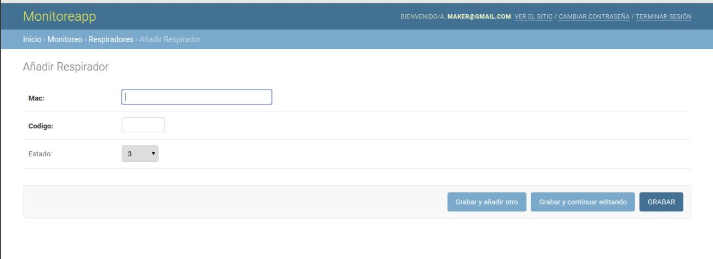

# Panel administrativo para fabricantes

En el panel podrá realizar las siguientes funciones:

- Administrar sus respiradores: Agregar, eliminar, editar su información. Ver el tiempo de uso y estado.

- Administrar las cuentas de sus clientes: Agregar, eliminar y editar las cuentas.

