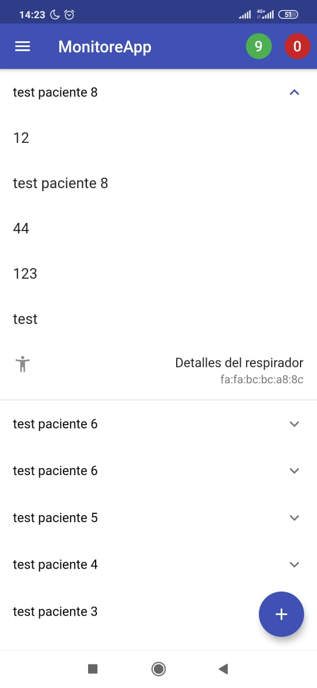

# Sistema de alarmas y notificaciones

En la parte principal de la aplicación se puede ver una barra superior, la cual tiene dos circulos, el de color rojo tiene el numero de pacientes en estado critico y el de color verde tiene el numero de pacientes en estado estable.

Esta clasificacion de pacientes se hace con respecto a si los pacientes cumplen o no con los limites establecidos de presion,volumen y frecuencia respiratoria.

Ademas, los pacientes en estado critico, podran identificarse en el listado, porque aparecen de color rojo.

Sumado a esto, MONITOREAPP cuenta con notificaciones directamente al celular, las cuales contienen en detalle que paciente y con que variable se ha disparado la alarma.

