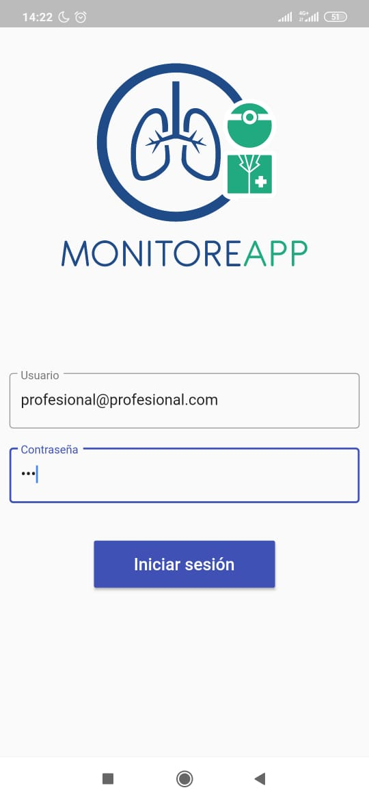
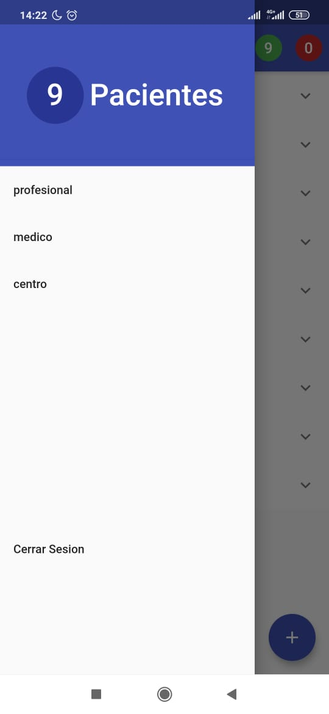

# Iniciando Sesión
Al abrir la aplicación, lo primero que encontrarás será el inicio de sesión, en esta sección tienes que ingresar tu usuario y contraseña. En caso de no tener usuario, debes dirigirte al centro asistencial donde trabajas y pedirlo.

Luego de iniciar sesión, se encuentra con un menú desplegable en la parte izquierda:

En este menú se puede ver el total de pacientes actuales, ademas de el nombre del profesional de salud, su area y centro asistencial al que pertenece. Además esta el boton para cerrar sesión.