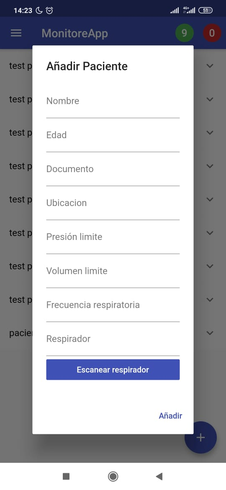

# Detalle del respirador

En la pantalla principal se puede ver la lista de los pacientes agregados.

Si hacemos presión sobre un elemento de la lista, podemos ver como se despliega el detalle del paciente.

Luego, al presionar sobre detalle del respirador, podemos ver una ventana con las variables de presion, volumen, frecuencia respiratoria y estado del respirador. Esta ventana se va actualizando en tiempo real con los datos enviados por el respirador.

- Si nos devolvemos a la vista principal tambien hay un boton flotante azul, el cual nos despliega una ventana emergente en la cual se agrega un nuevo paciente con su respirador.

- En el formulario para agregar un paciente se tienen que escribir datos del paciente, pero ademas la frecuencia limite, volumen limite y presion limite que el paciente puede manejar, esto con el fin de posteriormente poder dar alarmas basadas en estos limites. Tambien como se puede ver, esta la opcion de scanear el codigo qr del respirador, o simplemente escribir el codigo directamente, segun sea el caso de su proveedor.